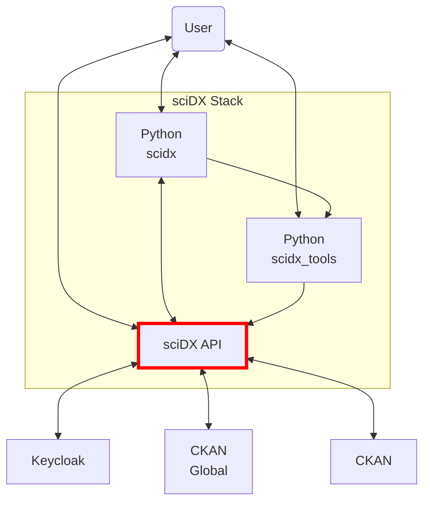

# scidx-api

> sciDX API

## Documentation Files

### docs/contributing.md (2,813 bytes)

# Contributing

Thank you for considering contributing to the sciDX API project! This document outlines the guidelines for contributing to the project.

## How to Contribute

### Reporting Bugs

If you find a bug in the project, please open an issue on GitHub and provide the following information:

- A clear and descriptive title for the issue.
- A description of the steps to reproduce the issue.
- Any relevant error messages or screenshots.
- Your environment details (e.g., operating system, Python version, etc.).

Refer to the [Guide to Creating Effective GitHub Issues](issues.md) for more information.

### Suggesting Enhancements

If you have an idea for a new feature or an improvement to an existing feature, please open an issue on GitHub and provide the following information:

- A clear and descriptive title for the enhancement.
- A detailed description of the proposed enhancement.
- Any relevant use cases or examples.

### Submitting Pull Requests

If you want to contribute code to the project, please follow these steps:

1. **Fork the repository**: Click the "Fork" button on the GitHub page to create a copy of the repository on your account.

2. **Clone the repository**: Clone your forked repository to your local machine.
    
```bash
git clone https://github.com/your-username/scidx-api.git
```

3. **Create a new branch**: Create a new branch for your feature or bugfix. Refer to the [Standard Branch Naming Convention](branch.md) for more information on naming branches.
    
```bash
git checkout -b [type]/[descriptive-name]
```

4. **Make your changes**: Make your changes to the codebase. Ensure that you follow the project's coding standards and include relevant tests.

5. **Commit your changes**: Commit your changes with a clear and descriptive commit message. Refer to the [Effective Commit Messages Guide](commit.md) for more information on writing good commit messages.
    
```bash
git commit -m "Description of the changes made"
```

6. **Push your changes**: Push your changes to your forked repository.
    
```bash
git push origin [type]/[descriptive-name]
```

7. **Create a pull request**: Open a pull request on the original repository. Provide a clear and descriptive title for the pull request and include any relevant information about the changes you made.

## Coding Standards

- Follow PEP 8 for Python code.
- Write clear and concise code with appropriate comments.
- Ensure that your code is well-tested and that all tests pass before submitting a pull request.

## Code of Conduct

By participating in this project, you agree to abide by the project's [Code of Conduct](code_of_conduct.md).

## Getting Help

If you need help or have any questions, feel free to open an issue on GitHub or reach out to the maintainers.

[Return to README.md](../README.md)

---

### requirements.txt (226 bytes)

pydantic_settings
fastapi
jinja2
prometheus_fastapi_instrumentator
ckanapi
pytest
aiokafka
pytest-asyncio
httpx
tenacity
cachetools
uvicorn
msgpack
zstandard
aiohttp
pandas
python-multipart
xarray
h5netcdf
h5py
sseclient
blosc

---

### docs/branch.md (2,156 bytes)

# Standard Branch Naming Convention for GitHub

Establishing a standard naming convention for branches in a GitHub project is crucial for maintaining organization and facilitating an understanding of each branch's purpose among team members. While there is no one-size-fits-all approach, there are common practices that many teams adopt to create an effective standard. Here's a recommended structure you can adjust according to your project's needs:

## General Structure

```
[type]/[descriptive-name]
```

## Common Types of Branches

- **feat**: For new features or significant additions to your project.
- **fix**: For bug fixes.
- **docs**: For changes to documentation.
- **style**: For changes that do not affect the meaning of the code (space, formatting, etc.).
- **refactor**: For code changes that neither fix a bug nor add a feature.
- **test**: For adding or correcting tests.
- **chore**: For updates and maintenance tasks without source code changes.

## Examples

- `feat/login-social-media`: Indicates the development of a new feature related to social media login.
- `fix/bug-login`: Refers to the correction of a specific bug in the login system.
- `docs/update-readme`: For updates or improvements to the project's README file.
- `refactor/cleanup-code-login`: Implies a restructuring of the login code, without changing its functionality.

## Tips for Branch Names

1. **Be brief but descriptive**: Names should be descriptive enough that anyone on the team can understand the purpose of the branch just by looking at its name, but not so long that they are hard to read or handle.
2. **Use dashes to separate words**: This enhances the readability of the branch name.
3. **Avoid special characters**: Keep the branch names simple and avoid using special characters or spaces.
4. **Prefix with the type of task**: Helps to quickly categorize branches and facilitates the search for branches related to specific tasks.
5. **Include task/ticket identifiers**: If your team uses a task or ticket tracking system, consider including the ticket identifier in the branch name for quick reference.

Return to [Contributing](contributing.md)

---

### docs/commit.md (1,824 bytes)

# Effective Commit Messages Guide

Writing clear and concise commit messages is crucial for maintaining a readable and understandable history in your project. This guide provides recommendations for writing effective commit messages within a 50-character limit.

## Structure of a Good Commit Message

A good commit message should answer two questions: what changed and why. However, given the 50-character limit, focus on the "what" and imply the "why" when possible.

```
[type]: Short Change Description or Issue Number
```

## Types of Changes

- **feat**: A new feature
- **fix**: A bug fix
- **docs**: Documentation only changes
- **style**: Changes that do not affect the meaning of the code
- **refactor**: A code change that neither fixes a bug nor adds a feature
- **test**: Adding missing tests or correcting existing tests
- **wip**: Work in progress (unfinished changes)

## Examples

- `feat: Add login API`
- `fix: Resolve login redirect`
- `fix: #23`
- `docs: Update README`
- `style: Format with Prettier`
- `refactor: Simplify login check`
- `test: Cover edge cases`
- `wip: implement feature topics list (#123)`

## Tips for Writing Concise Commit Messages

1. **Start with a Capital Letter**: Begin your message with a capital letter to maintain consistency.
2. **Use Present Tense**: Write your commit message in present tense, "Add feature" not "Added feature".
3. **No Period at the End**: Skip the period at the end of the message to save space and maintain formatting.
4. **Use Imperative Mood**: Frame your message as a command or instruction, "Fix bug" not "Fixes bug".
5. **Be Specific**: Use specific terms that directly reflect the changes made.

Remember, the goal of a commit message is to clearly and succinctly convey the essence of your change.

Return to [Contributing](contributing.md).

---

### docs/installation.md (2,735 bytes)

## Installation

Follow these steps to install and set up the sciDX API on your local machine:

### Prerequisites

Make sure you have the following installed on your system:

- **Python 3.8+**
- **Docker** and **Docker Compose**(if you plan to use the Docker setup). 
- **Git**
- *CKAN*, we are using the [Docker Compose setup for CKAN](https://github.com/ckan/ckan-docker).
- *Keycloak*, we are using the [official Keycloak on Docker tutorial].(https://www.keycloak.org/getting-started/getting-started-docker), with the version ```quay.io/keycloak/keycloak:25.0.4```.

### Clone the Repository

Clone the sciDX API repository from GitHub:

```bash
git clone https://github.com/your-username/scidx-api.git
cd scidx-api
```

### Environment Configuration

1. Copy the example environment files and adjust the configuration as needed:

   ```bash
   cp ./env_variables/.env_ckan.example ./env_variables/.env_ckan
   cp ./env_variables/.env_keycloak.example ./env_variables/.env_keycloak
   cp ./env_variables/.env_swagger.example ./env_variables/.env_swagger
   cp /env_variables/.env_dxspaces.example ./env_variables/.env_dxspaces

   ```

2. Edit the `.env` files to match your local environment or deployment needs.

### Install Dependencies

#### Option 1: Using Virtual Environment

1. Create and activate a virtual environment:

   ```bash
   python3 -m venv venv
   source venv/bin/activate   # On Windows use `venv\Scripts\activate`
   ```

2. Install the required Python packages:

   ```bash
   pip install -r requirements.txt
   ```

#### Option 2: Using Docker

1. Build and start the Docker containers:

   ```bash
   docker-compose up --build
   ```

### Running the Application

Start the application using one of the following methods:

- **With Virtual Environment**:

  ```bash
  uvicorn api.main:app --reload
  ```

- **With Docker**:

  ```bash
  docker-compose up
  ```

### Accessing the API

Once the application is running, you can access the sciDX API at:

- **Local environment**: `http://127.0.0.1:8000`
- **Docker environment**: `http://localhost:8000`

Return to [README](../README.md).

# Enable Staging
To enable beta support for data staging, append the contents of `requirements-staging.txt` to `requirements.txt`. A DXSpaces server must be available to both the sciDX API server, as well as any client in ordere to take full advantage of user query capabilities. Connection information is passed through the `DXSPACES_URL` environment variable. 

The environment variable `DXSPACES_REGISTRATION` controls which registrations are reported to DXSpaces, provided a DXSpaces server is configured. This is a comma-separated list of methods, `all`, or `none`. Supported methods are currently: `url` and `s3`.

---

### docs/issues.md (3,205 bytes)

# Guide to Creating Effective GitHub Issues

Creating well-documented issues on GitHub helps teams communicate effectively about tasks, enhancements, and bugs. An essential part of this process is giving your issue a clear title and categorizing it properly.

## Naming Your Issue:

The title of your issue should be descriptive yet concise. It should give a clear indication of the problem or feature request at a glance. Here’s a format you might consider using:

- **Bugs**: `[Bug] Short description of the problem`
- **Feature Requests**: `[Feature] Short description of the new feature`
- **Documentation**: `[Docs] Description of the documentation change`
- **Other Types**: `[Type] Description`, where type could be Refactor, Test, Chore, etc.

## Differences Between Issue Types:

- **Bugs**: Issues that report a problem or unexpected behavior in the project. They should include steps to reproduce the issue, the expected outcome, and the actual outcome.
- **Feature Requests**: Suggestions for new features or improvements to existing functionality. Describe what you wish to achieve and why it would be beneficial.
- **Documentation**: Requests or suggestions for improvements to the project's documentation. This can include missing documentation or clarifications on existing content.
- **Others**: This category includes code refactoring, tests, or maintenance tasks that don't necessarily add new features or fix bugs but are essential for project health.

## Creating an Issue:

1. **Navigate to the Issues tab** of the relevant repository and click on "New Issue."
2. **Select a Template** if applicable. Use the appropriate template for bugs, feature requests, or other issue types.
3. **Fill in the Issue Title**: Use the naming conventions mentioned above to provide a clear and concise title.
4. **Describe the Issue** in detail:
   - **Description**: Give a summary of the issue.
   - **Steps to Reproduce** (for bugs): Clearly list the steps to demonstrate the issue.
   - **Expected Behavior**: What should happen?
   - **Actual Behavior**: What actually happens?
   - **Possible Solution**: Suggest a possible fix if you have one.
   - **Additional Context**: Any other information, like screenshots or error messages.
5. **Submit the Issue**: Review the details and submit your issue.

## Simple Issue Template Example

Use the following template in your GitHub repository to streamline the issue creation process:

```markdown
# Issue Template

## Description
Please provide a brief description of the problem or the feature request. Be clear and concise.

## Steps to Reproduce
For bugs, list the steps required to reproduce the issue, if applicable:
1.
2.
3.

## Expected Behavior
For bugs, describe what you expected to happen.
For feature requests, describe what feature you would like to see implemented.

## Actual Behavior
For bugs, describe what actually happened. Include any error messages or unexpected outcomes.

## Possible Solution
If you have any suggestions on how to fix the bug or implement the feature, please share them here.

## Additional Context
Add any other context or screenshots about the issue here.
```

Return to [Contributing](contributing.md)

---

### docs/other_info.md (839 bytes)



---

### docs/tutorial/api_with_requests.md (4,422 bytes)

# Tutorial: Using the scidx-api with Python and Requests

This tutorial will guide you through using the scidx-api for creating, searching, and managing datasets and organizations using Python's `requests` library.

## Prerequisites

Before starting, make sure you have:
1. An instance of CKAN running.
2. The scidx-api running. You can start the API with:

```bash
uvicorn api.main:app --reload
```

3. Python installed on your machine.
4. The `requests` library installed. You can install it using:

```bash
pip install requests
```

## Base URL

The base URL for the API is `http://127.0.0.1:8000`.

## Understanding Organizations

In CKAN, an organization is a way to group datasets and manage them collectively. It helps in organizing datasets related to a particular project, department, or domain. An organization can have multiple datasets and users can have different roles within the organization.

## Creating an Organization

To create a new organization, you need to send a POST request with the organization's details.

```python
import requests

base_url = "http://127.0.0.1:8000"

organization_name = input("Enter the name for the organization: ")
organization_data = {
    "name": organization_name,
    "title": input("Enter the title for the organization: "),
    "description": input("Enter a description for the organization: ")
}

response = requests.post(f"{base_url}/organization", json=organization_data)

if response.status_code == 201:
    organization_id = response.json()["id"]
    print(f"Organization created successfully with ID: {organization_id}")
else:
    print(f"Error: {response.json()['detail']}")
```

## Registering a Data Source

Once the organization is created, you can register a new dataset under it.

```python
dataset_data = {
    "dataset_name": input("Enter the dataset name: "),
    "dataset_title": input("Enter the dataset title: "),
    "owner_org": organization_name,
    "resource_url": input("Enter the resource URL: "),
    "resource_name": input("Enter the resource name: "),
    "dataset_description": input("Enter the dataset description: "),
    "resource_description": input("Enter the resource description: "),
    "resource_format": input("Enter the resource format (e.g., CSV): ")
}

response = requests.post(f"{base_url}/datasource", json=dataset_data)

if response.status_code == 201:
    dataset_id = response.json()["id"]
    print(f"Dataset created successfully with ID: {dataset_id}")
else:
    print(f"Error: {response.json()['detail']}")
```

## Searching for Data Sources

You can search for datasets by different criteria. Below are a few examples:

### Search by Dataset Name

```python
dataset_name = input("Enter the dataset name to search for: ")
response = requests.get(f"{base_url}/datasource", params={"dataset_name": dataset_name})

if response.status_code == 200:
    results = response.json()
    print(f"Datasets found: {results}")
else:
    print(f"Error: {response.json()['detail']}")
```

### Search by Organization Name

```python
response = requests.get(f"{base_url}/datasource", params={"owner_org": organization_name})

if response.status_code == 200:
    results = response.json()
    print(f"Datasets found: {results}")
else:
    print(f"Error: {response.json()['detail']}")
```

### Search by Term

```python
search_term = input("Enter the search term: ")
response = requests.get(f"{base_url}/datasource", params={"search_term": search_term})

if response.status_code == 200:
    results = response.json()
    print(f"Datasets found: {results}")
else:
    print(f"Error: {response.json()['detail']}")
```

## Listing All Organizations

You can list all organizations available in the CKAN instance.

```python
response = requests.get(f"{base_url}/organization")

if response.status_code == 200:
    organizations = response.json()
    print(f"Organizations: {organizations}")
else:
    print(f"Error: {response.json()['detail']}")
```

## Deleting an Organization

To delete an organization and all its datasets, send a DELETE request with the organization's name.

```python
response = requests.delete(f"{base_url}/organization/{organization_name}")

if response.status_code == 200:
    print(f"Organization deleted successfully.")
else:
    print(f"Error: {response.json()['detail']}")
```

You can find the complete Python script that follows this tutorial [here](api_with_requests.py).

Return to [README](../README.md).

---

### requirements-staging.txt (15 bytes)

dxspaces>=0.0.5

---

## Source Files

Source code files are processed separately by the processor.
File list:

- `.gitignore` (3,219 bytes)
- `Dockerfile` (357 bytes)
- `api/__init__.py` (0 bytes)
- `api/config/__init__.py` (186 bytes)
- `api/config/ckan_settings.py` (653 bytes)
- `api/config/dxspaces_settings.py` (1,122 bytes)
- `api/config/kafka_settings.py` (285 bytes)
- `api/config/keycloak_settings.py` (423 bytes)
- `api/config/swagger_settings.py` (378 bytes)
- `api/main.py` (2,134 bytes)
- `api/models/__init__.py` (335 bytes)
- `api/models/datasourcerequest_model.py` (1,835 bytes)
- `api/models/datasourceresponse_model.py` (3,139 bytes)
- `api/models/organizationdeleterequest_model.py` (287 bytes)
- `api/models/organizationrequest_model.py` (743 bytes)
- `api/models/request_kafka_model.py` (2,081 bytes)
- `api/models/request_stream_model.py` (773 bytes)
- `api/models/response_kafka_model.py` (2,828 bytes)
- `api/models/s3request_model.py` (1,248 bytes)
- `api/models/searchrequest_model.py` (1,500 bytes)
- `api/models/token_model.py` (685 bytes)
- `api/models/update_kafka_model.py` (2,078 bytes)
- `api/models/update_s3_model.py` (1,278 bytes)
- `api/models/update_url_model.py` (4,608 bytes)
- `api/models/urlrequest_model.py` (5,848 bytes)
- `api/routes/__init__.py` (360 bytes)
- `api/routes/default_routes/__init__.py` (126 bytes)
- `api/routes/default_routes/get.py` (200 bytes)
- `api/routes/delete_routes/__init__.py` (285 bytes)
- `api/routes/delete_routes/delete_dataset.py` (3,525 bytes)
- `api/routes/delete_routes/delete_organization_route.py` (1,833 bytes)
- `api/routes/register_routes/__init__.py` (733 bytes)
- `api/routes/register_routes/post_datasource.py` (2,283 bytes)
- `api/routes/register_routes/post_kafka.py` (4,386 bytes)
- `api/routes/register_routes/post_organization.py` (3,169 bytes)
- `api/routes/register_routes/post_s3.py` (2,473 bytes)
- `api/routes/register_routes/post_stream.py` (6,252 bytes)
- `api/routes/register_routes/post_url.py` (6,164 bytes)
- `api/routes/search_routes/__init__.py` (542 bytes)
- `api/routes/search_routes/get.py` (3,481 bytes)
- `api/routes/search_routes/get_stream.py` (3,849 bytes)
- `api/routes/search_routes/list_organizations_route.py` (1,902 bytes)
- `api/routes/search_routes/post_search_datasource_route.py` (4,494 bytes)
- `api/routes/search_routes/search_datasource_route.py` (6,668 bytes)
- `api/routes/status_routes/__init__.py` (126 bytes)
- `api/routes/status_routes/get.py` (1,708 bytes)
- `api/routes/token_routes/__init__.py` (129 bytes)
- `api/routes/token_routes/post.py` (1,357 bytes)
- `api/routes/update_routes/__init__.py` (267 bytes)
- `api/routes/update_routes/put_kafka.py` (3,023 bytes)
- ... and 57 more files
